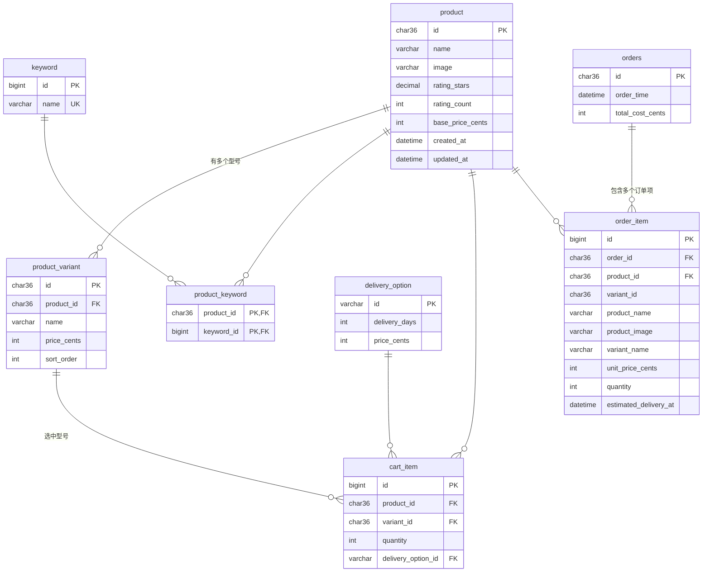

# Ecommerce 数据库设计图 (ER Diagram)

下面是 Mermaid 版的实体关系图。在 VS Code 里装 **Markdown Preview Mermaid Support** 扩展，
或直接在 GitHub 上打开本文件，都能看到带连线的关系图。

## 关系说明

| 关系 | 基数 | 说明 |
| --- | --- | --- |
| product → product_variant | 1 : N | 一个商品有多个型号，型号价格不同 |
| product ↔ keyword | N : N | 通过 product_keyword 关联，供类别筛选 |
| product → cart_item | 1 : N | 购物车项引用商品 |
| product_variant → cart_item | 1 : N | 购物车项引用选中的型号（决定价格） |
| delivery_option → cart_item | 1 : N | 购物车项的配送方式 |
| orders → order_item | 1 : N | 一个订单包含多个订单项 |
| product → order_item | 1 : N | 订单项引用商品（价格/名称已快照，不随改价变动） |
