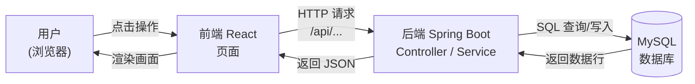
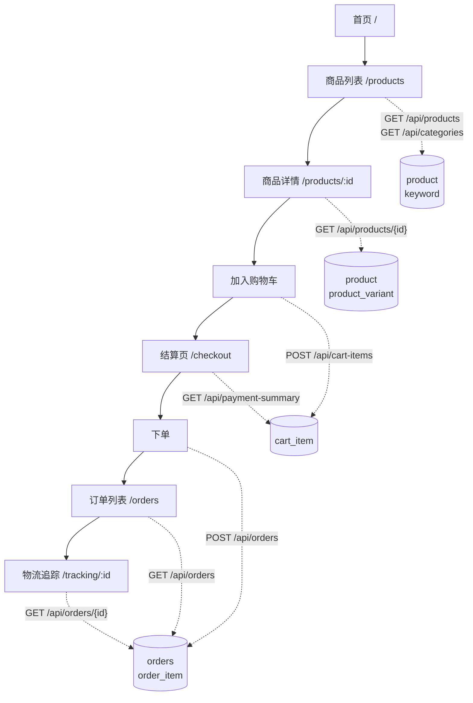
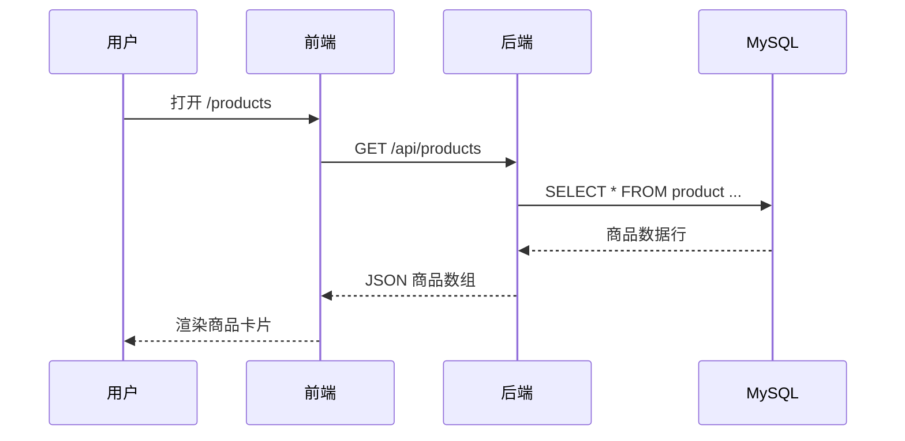
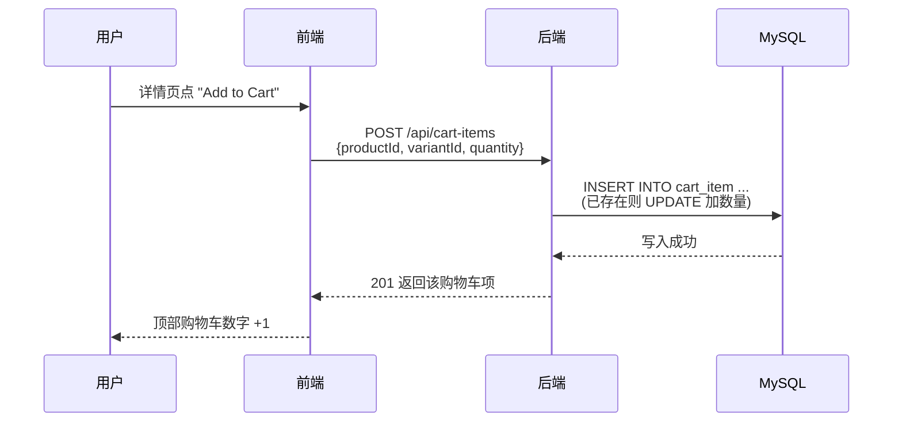
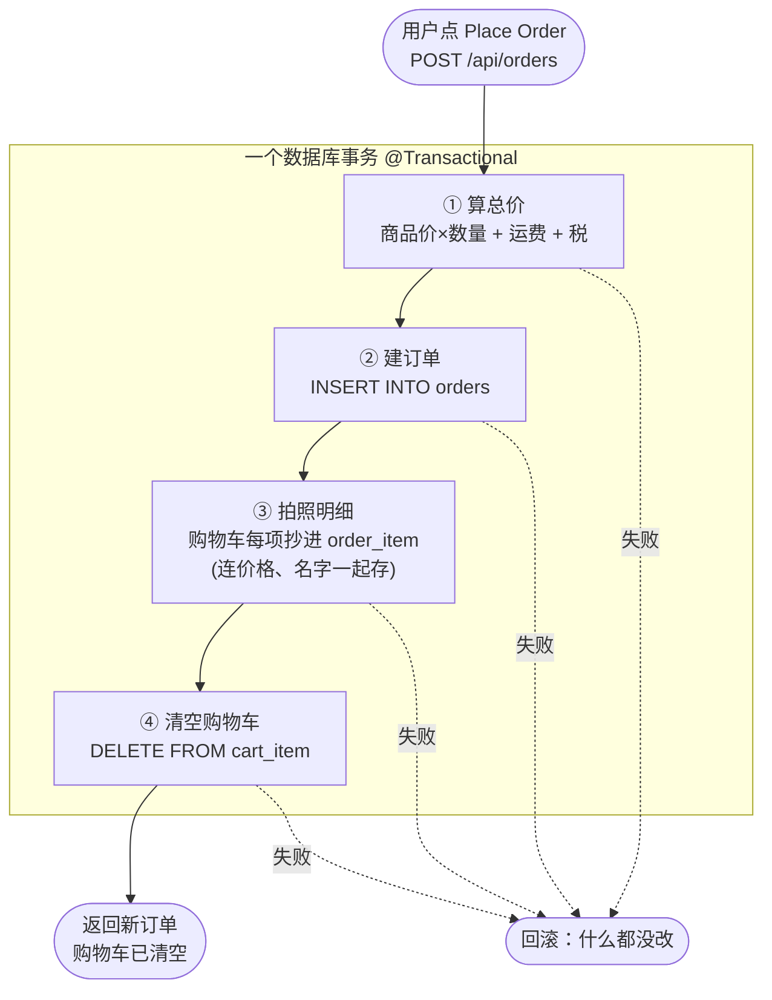
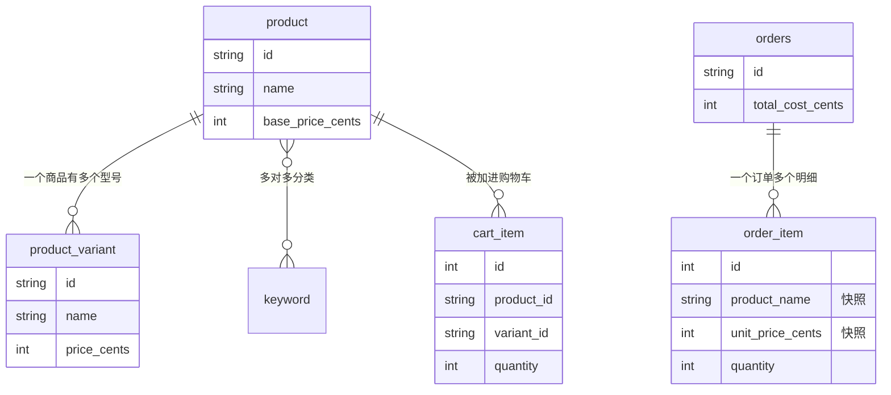
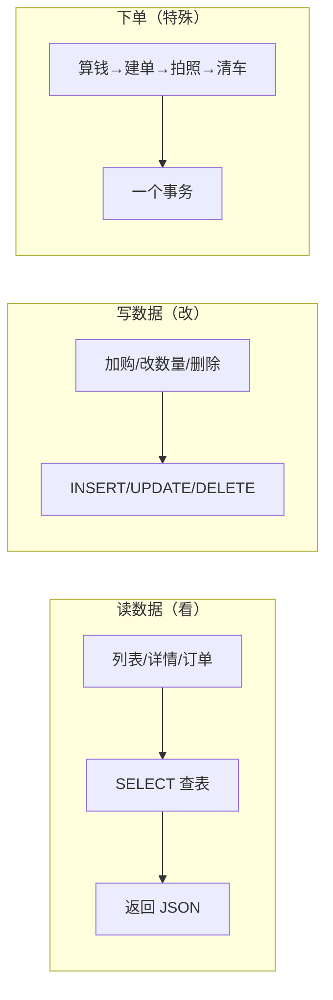

# 数据流程图（新手版）

> 配合 `backend-api-design-simple.md` 看。用 Mermaid 画图。
> 在 VS Code 里装 **Markdown Preview Mermaid Support** 扩展，或直接在 GitHub 打开本文件即可看到图。

---

## 1. 三层结构：数据在哪里流

整个系统就三层，数据在它们之间来回跑：

一句话：**用户点一下 → 前端发请求 → 后端执行 SQL → 数据库给数据 → 一路返回并显示**。

---

## 2. 用户旅程：每个页面用哪些接口、碰哪些表

实线 = 用户走的路；虚线 = 该页面调的接口和碰的表。

---

## 3. 读数据：以"看商品列表"为例

最常见的流程，浏览类接口都长这样：

---

## 4. 写数据：以"加入购物车"为例

---

## 5. 下单：四步一个事务（最重要）

下单要在**一个事务**里做完 4 件事，任何一步失败就全部回滚：

> **为什么第③步要"拍照"？** 商品以后可能涨价，但历史订单金额不能变。
> 所以下单时把当时的价格/名字抄一份存进 `order_item`，以后查订单只看这份抄件。

---

## 6. 表之间的关系（简版）

---

## 7. 一图记住全局

看懂这几张图，就掌握了整个后端的数据流。细节（分页、校验、错误码）再看 `backend-api-design.md`。
